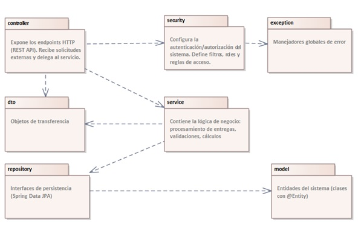
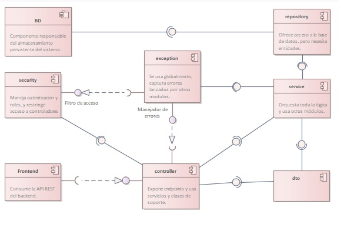
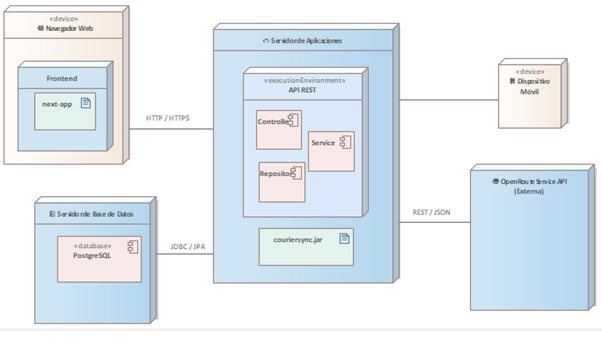
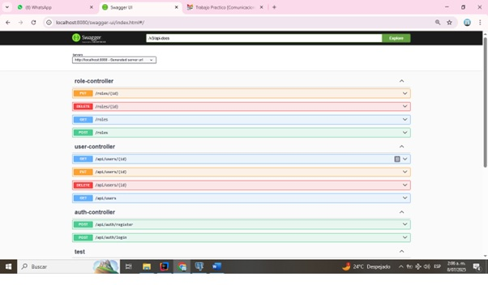
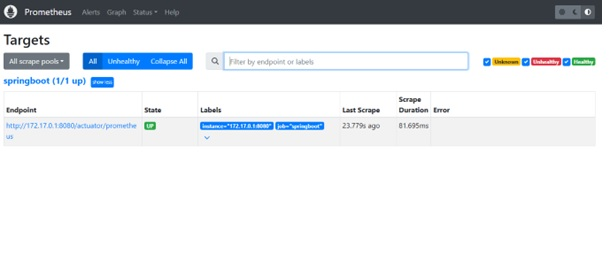
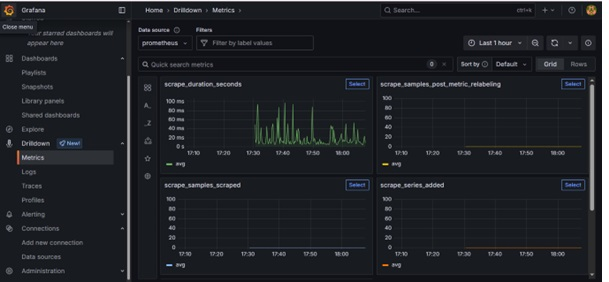
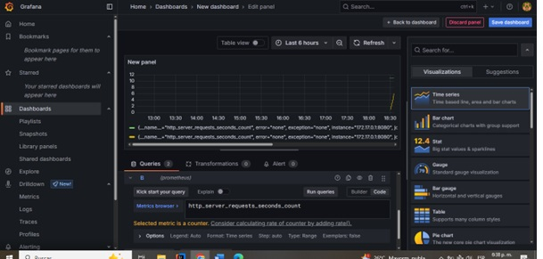
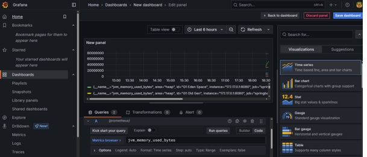

# 📦 CourierSync – Sprint 1  

## 🚀 Feature: Optimización de Rutas

### 👥 Estudiantes:
- Cristian Agudelo Márquez  
- Jonatan Romero Arrieta  

### 👨‍🏫 Profesor:

- Diego Botia
- 
- Universidad de Antioquia – Facultad de Ingeniería

---

## 📌 Contexto del Sistema

La feature **"Optimización de Rutas"** forma parte del sistema **CourierSync**, diseñado para mejorar la eficiencia logística de una empresa de transporte. Permite calcular rutas óptimas considerando distancia, tráfico y prioridad de entrega.

### ✅ Problemas que resuelve:
- Reducción de tiempos de entrega  
- Ahorro de combustible  
- Mejor uso de recursos (vehículos y conductores)  
- Mayor trazabilidad de rutas  

### 👤 Principales usuarios:
- Administradores logísticos  
- Conductores  
- Operadores de monitoreo  

---

## 🏗️ Requisitos Arquitectónicos

### ✅ No Funcionales:
- Generación de rutas en menos de 3 segundos  
- Alta disponibilidad: 99.9%  
- Escalabilidad para múltiples solicitudes concurrentes  
- Seguridad: cifrado y autenticación por roles

### ⚙️ Restricciones Técnicas:
- Lenguaje: Java 17  
- Framework: Spring Boot  
- Base de datos: PostgreSQL  
- ORM: Hibernate (JPA)  
- API: RESTful (Spring MVC)  
- Seguridad: Spring Security + JWT  
- Otros: Lombok, ModelMapper  

---

## 🧱 Estilos y Patrones Arquitectónicos

### 🧩 Arquitectura en Capas:
- **Controller:** Control de entrada/salida HTTP  
- **Service:** Lógica de negocio  
- **Repository:** Persistencia con JPA  
- **Model/DTO:** Datos y transferencia  
- **Security/Exception:** Seguridad y errores globales

### 🔁 Patrones Aplicados:
- DTO (Data Transfer Object)  
- Repository Pattern  
- Seguridad basada en JWT  
- Inyección de Dependencias (IoC)  

---

El backend está dividido en los siguientes paquetes:

- `controller`: Manejo de endpoints HTTP  
- `service`: Lógica del sistema (negocio)  
- `repository`: Acceso a datos y queries  
- `model`: Entidades JPA (tablas)  
- `dto`: Transferencia de datos entre capas  
- `security`: JWT y filtros de seguridad  
- `exception`: Captura de errores personalizados  

---

## 🧩 Vista de Componentes

Relaciones entre paquetes principales:

> Esta vista representa las dependencias entre los módulos lógicos del backend.

---

## 🌐 Vista de Despliegue

El sistema está desplegado en tres entornos distintos:

| Componente   | Plataforma | Tecnología |
|--------------|------------|------------|
| Frontend     | Vercel     | Next.js    |
| Backend API  | Render     | Spring Boot (Docker) |
| Base de Datos| Railway    | PostgreSQL |

---

## 🔌 API REST - Endpoints

Listado base de endpoints:

| Método | Endpoint             | Descripción                 |
|--------|----------------------|-----------------------------|
| POST   | /api/auth/register   | Registrar usuario           |
| POST   | /api/auth/login      | Login y generación de token |
| GET    | /api/users           | Obtener todos los usuarios  |
| GET    | /api/users/{id}      | Obtener un usuario por ID   |
| PUT    | /api/users/{id}      | Actualizar usuario          |
| DELETE | /api/users/{id}      | Eliminar usuario            |
| POST   | /roles               | Crear rol                   |
| PUT    | /roles/{id}          | Actualizar rol              |
| DELETE | /roles/{id}          | Eliminar rol                |
| GET    | /roles               | Listar roles disponibles    |

## Implementación con openAPI/Swagger:

> 🔐 Todos los endpoints protegidos requieren token JWT con rol de `ADMINISTRATOR`.

---

## 📊 Monitoreo con Prometheus y Grafana

Se configuró monitoreo a nivel de aplicación usando contenedores Docker.

| Herramienta | Puerto | Función                    |
|-------------|--------|----------------------------|
| Prometheus  | 9090   | Recolector de métricas     |
| Grafana     | 3001   | Visualización de métricas  |

La aplicación backend está dockerizada con:

## 📦 Docker y Despliegue

La aplicación backend está dockerizada con:

- `Dockerfile` para construir la imagen del backend.
- `docker-compose.yml` que orquesta los contenedores de:
  - Backend (Spring Boot)
  - Prometheus
  - Grafana
  - PostgreSQL

### 🖼️ Evidencias disponibles:
- ✅ Prometheus detecta el target `springboot` como **UP**.
  
   
  
- ✅ Grafana visualiza métricas como:

   
  
  - Uso de memoria (JVM)
  - Solicitudes HTTP
    
   

   

---

## ⚙️ Herramientas utilizadas

- **Spring Boot 3.4.5**
- **PostgreSQL**
- **Docker Compose**
- **Grafana / Prometheus**
- **Enterprise Architect** (diagramas UML)
- **GitHub Codespaces** (entorno de desarrollo)

---

> Elaborado como parte del **Sprint 2** del proyecto **CourierSync – Arquitectura de Software 2025**.

